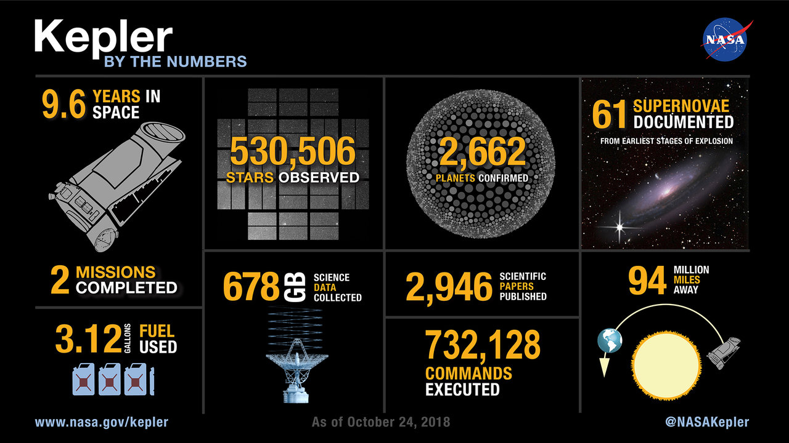

<!-- PROJECT LOGO -->
 

  

  <h2 align="center">Kepler Telescope Search</h2>

  

    Developing classification machine learning models using <a href="https://scikit-learn.org/stable/">sklearn</a>, to discover hidden planets outside of our solar system, using data collected by the NASA Kepler space telescope.
     
     
    <a href="https://www.kaggle.com/nasa/kepler-exoplanet-search-results">Data Source</a>
    ·
    <a href="https://github.com/RaulMaya/Kepler-Telescope-Search/tree/master/models">Explore the docs</a>
    ·
    <a href="https://github.com/RaulMaya/Kepler-Telescope-Search/tree/master/data">CSV File</a>
  

<!-- ABOUT THE PROJECT -->
### About The Project

Over a period of nine years in deep space, the NASA Kepler space telescope has been out on a planet-hunting mission to discover hidden planets outside of our solar system.

To help process this data, you will create machine learning models capable of classifying candidate exoplanets from the raw dataset.

(<a href="#top">back to top</a>)

### Selected Models

This section lists the selected machine learning models, for future evaluations between all the listed models, once evaluated, it can be selected which models are good enough to predict new exoplanets, and which model is the best to predict them.

* [LogisticRegression](https://scikit-learn.org/stable/modules/generated/sklearn.linear_model.LogisticRegression.html?highlight=logistic#sklearn.linear_model.LogisticRegression)
* [SVC](https://scikit-learn.org/stable/modules/generated/sklearn.svm.SVC.html#sklearn.svm.SVC)
* [KNeighborsClassifier](https://scikit-learn.org/stable/modules/generated/sklearn.neighbors.KNeighborsClassifier.html?highlight=kneighbors#sklearn.neighbors.KNeighborsClassifier)
* [Decision Tree](https://scikit-learn.org/stable/modules/generated/sklearn.tree.DecisionTreeClassifier.html?highlight=decision%20tree#sklearn.tree.DecisionTreeClassifier)
* [Random Forest](https://scikit-learn.org/stable/modules/generated/sklearn.ensemble.RandomForestClassifier.html?highlight=random%20forest#sklearn.ensemble.RandomForestClassifier)

(<a href="#top">back to top</a>)

### Concepts Glossary

* [Accuracy](https://scikit-learn.org/stable/modules/generated/sklearn.metrics.accuracy_score.html#sklearn.metrics.accuracy_score): Ratio of corrected predicted observations to the total number of observations; The fraction of correctly classified samples, is not always an useful metric.

* [Precision](https://scikit-learn.org/stable/modules/generated/sklearn.metrics.precision_score.html#sklearn.metrics.precision_score): It is the percentage of correctly classified observations in our model; Example: The number of correctly divided by the total number of emails classified as spam; from the spam emails that your model classify, which ones are really spam.

* [Recall](https://scikit-learn.org/stable/modules/generated/sklearn.metrics.recall_score.html#sklearn.metrics.recall_score): Refers where you classify your negative cases, if you don't confuse negative cases with positive cases. Example: in a RED and BLUE classification problem, the recall stands for the 100 % of BLUES, how many of them did you recognize correctly.

* [F1-Score](https://scikit-learn.org/stable/modules/generated/sklearn.metrics.f1_score.html#sklearn.metrics.f1_score): It combines the precision and recall of a classifier into a single metric by taking their harmonic mean. It is primarily used to compare the performance of two classifiers.

* [Support](https://scikit-learn.org/stable/modules/model_evaluation.html): It stands for the number of observations.

(<a href="#top">back to top</a>)

### Model Comparison

| Model      | Scaling         | Best Parameters | Accuracy   | Features  |
| ------------- | ------------- | ----- | ---- | ---- |
| LogisticRegression | MinMaxScaler | C: 78.47599703514607, max_iter: 1000, multi_class: multinomial, penalty: l2, solver: lbfgs | 85.56 %  | 10 |
| SVC     | MinMaxScaler      | C: 10,  gamma: 0.0001| 86.51% | 15 |
| KNeighborsClassifier | MinMaxScaler | n_neighbors: 16   | 82.79 % | 40  |
| Decision Tree | MinMaxScaler | criterion: entropy, max_leaf_nodes: 19, min_sample_split: 2 | 88.32 % | 7  |
| Random Forest | MinMaxScaler | n_estimators: 500 | 87.31 % | 16 |

- #### Logistic Regression Model

  - Classification Report:

    |      | Precision  | Recall| F1-Score   | Support |
    | ------------- | ------------- | ----- | ---- | ---- |
    | CONFIRMED | 0.72 | 0.80 | 0.76 | 574 |
    | FALSE POSITIVE  | 0.98 | 1.00| 0.99 | 1020 |
    | CANDIDATE | 0.76 | 0.62 | 0.68 | 504 |

  - According to the Classification Report of the **Logistic Regression Model**:
      - In the precision topic, only 72% of the values that were predicted as **CONFIRMED** are **TRUE CONFIRMED**, meanwhile 98% of the values that were predicted as **FALSE POSITIVES** are **TRUE FALSE POSITIVES**, for the **CANDIDATES** predictions only 76% of the values predicted as CANDIDATES were **TRUE CANDIDATES** values.

      - For the recall, the model recognize correctly 80% of 100% **CONFIRMED** values (From the 100% of **CONFIRMED** values, which percentage our model recognize correctly), for the **FALSE POSITIVE** values it seems that the model had a perfect recall (100%) of recognizing **FALSE POSITIVE** values. Meanwhile in the **CANDIDATE** target, the model recognize only the 62% of the 100% **CANDIDATES**.

- #### SVC Model

  - Classification Report:

    |      | Precision  | Recall| F1-Score   | Support |
    | ------------- | ------------- | ----- | ---- | ---- |
    | CONFIRMED | 0.72 | 0.80 | 0.76 | 574 |
    | FALSE POSITIVE  | 0.98 | 1.00| 0.99 | 1020 |
    | CANDIDATE | 0.80 | 0.62 | 0.70 | 504 |

    - According to the Classification Report of the **SVC Model**:
        - In the precision topic, only 72% of the values that were predicted as **CONFIRMED** are **TRUE CONFIRMED**, meanwhile 98% of the values that were predicted as **FALSE POSITIVES** are **TRUE FALSE POSITIVES**, for the **CANDIDATES** predictions only 80% of the values predicted as CANDIDATES were **TRUE CANDIDATES** values.

        - For the recall, the model recognize correctly 80% of 100% **CONFIRMED** values (From the 100% of **CONFIRMED** values, which percentage our model recognize correctly), for the **FALSE POSITIVE** values it seems that the model had a perfect recall (100%) of recognizing **FALSE POSITIVE** values. Meanwhile in the **CANDIDATE** target, the model recognize only the 62% of the 100% **CANDIDATES**.

- #### KNeighborsClassifier Model

  - Classification Report:

    |      | Precision  | Recall| F1-Score   | Support |
    | ------------- | ------------- | ----- | ---- | ---- |
    | CONFIRMED | 0.67 | 0.75 | 0.71 | 574 |
    | FALSE POSITIVE  | 0.98 | 1.00| 0.99 | 1020 |
    | CANDIDATE | 0.69 | 0.57 | 0.62 | 504 |

    - According to the Classification Report of the **KNeighborsClassifier Model**:
        - In the precision topic, only 67% of the values that were predicted as **CONFIRMED** are **TRUE CONFIRMED**, meanwhile 98% of the values that were predicted as **FALSE POSITIVES** are **TRUE FALSE POSITIVES**, for the **CANDIDATES** predictions only 69% of the values predicted as CANDIDATES were **TRUE CANDIDATES** values.

        - For the recall, the model recognize correctly 75% of 100% **CONFIRMED** values (From the 100% of **CONFIRMED** values, which percentage our model recognize correctly), for the **FALSE POSITIVE** values it seems that the model had a perfect recall (100%) of recognizing **FALSE POSITIVE** values. Meanwhile in the **CANDIDATE** target, the model recognize only the 57% of the 100% **CANDIDATES**.

- #### Decision Tree Model

  - Classification Report:

    |      | Precision  | Recall| F1-Score   | Support |
    | ------------- | ------------- | ----- | ---- | ---- |
    | CONFIRMED | 0.75 | 0.87 | 0.81 | 574 |
    | FALSE POSITIVE  | 0.98 | 1.00| 0.99 | 1020 |
    | CANDIDATE | 0.84 | 0.66 | 0.74 | 504 |

    - According to the Classification Report of the **Decision Tree Model**:
        - In the precision topic, only 75% of the values that were predicted as **CONFIRMED** are **TRUE CONFIRMED**, meanwhile 98% of the values that were predicted as **FALSE POSITIVES** are **TRUE FALSE POSITIVES**, for the **CANDIDATES** predictions only 84% of the values predicted as CANDIDATES were **TRUE CANDIDATES** values.

        - For the recall, the model recognize correctly 87% of 100% **CONFIRMED** values (From the 100% of **CONFIRMED** values, which percentage our model recognize correctly), for the **FALSE POSITIVE** values it seems that the model had a perfect recall (100%) of recognizing **FALSE POSITIVE** values. Meanwhile in the **CANDIDATE** target, the model recognize only the 66% of the 100% **CANDIDATES**.

- #### Random Forest Model

  - Classification Report:

    |      | Precision  | Recall| F1-Score   | Support |
    | ------------- | ------------- | ----- | ---- | ---- |
    | CONFIRMED | 0.82 | 0.83 | 0.83 | 574 |
    | FALSE POSITIVE  | 0.98 | 1.00| 0.99 | 1020 |
    | CANDIDATE | 0.82 | 0.78 | 0.80 | 504 |

    - According to the Classification Report of the **Random Forest Model**:
        - In the precision topic, only 82% of the values that were predicted as **CONFIRMED** are **TRUE CONFIRMED**, meanwhile 98% of the values that were predicted as **FALSE POSITIVES** are **TRUE FALSE POSITIVES**, for the **CANDIDATES** predictions only 82% of the values predicted as CANDIDATES were **TRUE CANDIDATES** values.

        - For the recall, the model recognize correctly 83% of 100% **CONFIRMED** values (From the 100% of **CONFIRMED** values, which percentage our model recognize correctly), for the **FALSE POSITIVE** values it seems that the model had a perfect recall (100%) of recognizing **FALSE POSITIVE** values. Meanwhile in the **CANDIDATE** target, the model recognize only the 78% of the 100% **CANDIDATES**.

(<a href="#top">back to top</a>)

### Model Selection (Conclusion)

### Contact :iphone:

* Name: Raul Maya Salazar
* Phone: +52 833 159 7006
* E-mail: raulmayas20@gmail.com
* GitHub: https://github.com/RaulMaya
* LinkedIn: https://www.linkedin.com/in/raul-maya/

(<a href="#top">back to top</a>)

